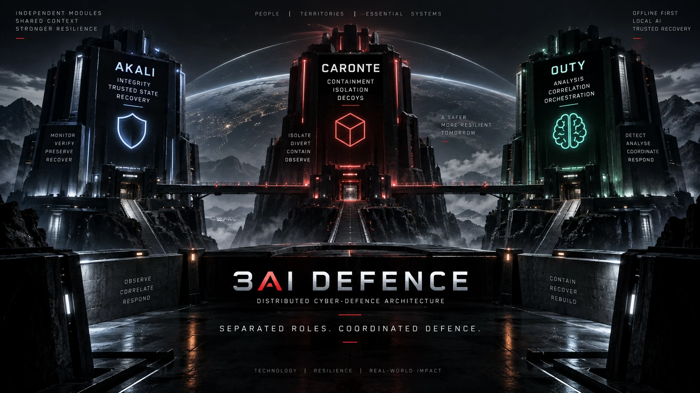

# 3AI Defence



## Distributed Cyber-Defence Architecture

3AI Defence is a distributed cyber-defence architecture built around physical
separation of defensive responsibilities, local AI, controlled containment,
trusted recovery and offline-first resilience.

The system is organized around three independent but coordinated defensive
modules:

- **Akali** — integrity, trusted state and recovery
- **Caronte** — containment and controlled decoy environments
- **Outy** — analysis, correlation and orchestration

```text
                    3AI DEFENCE
                         |
          +--------------+--------------+
          |              |              |
          v              v              v
        AKALI          CARONTE         OUTY
      Integrity      Containment      Analysis
       Recovery        Decoys      Orchestration
          |              |              |
          +--------------+--------------+
                         |
                         v
             Coordinated Cyber Defence
```

---

# Core Principle

3AI Defence separates critical defensive responsibilities instead of
concentrating them inside one security component.

```text
Integrity
    |
Containment
    |
Analysis
    |
Recovery
```

The modules remain distinct while exchanging the information required for
coordinated defensive decisions.

---

# Akali

Akali is the integrity and trusted-recovery module.

Its architectural responsibilities include:

- monitoring critical integrity state
- validating trusted system state
- maintaining trusted recovery material
- identifying anomalous modification
- supporting selective restoration

Conceptually:

```text
Protected System
      |
      v
Integrity Observation
      |
      v
Akali
      |
      +--> Trusted State
      +--> Integrity Signals
      `--> Recovery Capability
```

See [Akali](docs/akali.md).

---

# Caronte

Caronte is the containment module.

Its architectural responsibilities include:

- isolating suspicious or compromised areas
- separating protected assets from incident activity
- providing controlled decoy environments
- collecting defensive observations from contained incidents

Conceptually:

```text
Suspicious Activity
        |
        v
     Caronte
        |
    +---+---+
    |       |
    v       v
Isolate   Decoy
    |       |
    +---+---+
        |
        v
Protected Environment
```

See [Caronte](docs/caronte.md).

---

# Outy

Outy is the analytical and orchestration module.

Its architectural responsibilities include:

- analysing security telemetry
- correlating signals from Akali and Caronte
- evaluating defensive state
- supporting defensive decisions
- coordinating responses between modules
- using local AI where appropriate

Conceptually:

```text
Akali Signals -------+
                     |
                     v
                    Outy
                     |
                     v
              Security Context
                     |
                     v
             Coordinated Response
                     ^
                     |
Caronte Signals -----+
```

See [Outy](docs/outy.md).

---

# Coordinated Defence

The value of the architecture comes from cooperation between distinct modules.

```text
Observe
   |
   v
Detect
   |
   v
Correlate
   |
   v
Contain
   |
   v
Recover
   |
   v
Audit / Learn
```

The public architecture describes this cooperation without exposing private
production rules, thresholds, internal models or security-sensitive
implementation details.

See [Coordination](docs/coordination.md).

---

# Detection, Response and Recovery

At a high level:

```text
NORMAL OPERATION
      |
      v
Anomaly / Compromise Signal
      |
      v
Correlation
      |
      v
Containment
      |
      v
Trusted Recovery
      |
      v
Healthy State
      |
      v
Audit / Defensive Improvement
```

See [Detection, Response and Recovery](docs/detection-response-recovery.md).

---

# Offline-First Resilience

A defining architectural characteristic of 3AI Defence is the ability to
operate without permanent dependence on Internet connectivity.

The architecture is designed for environments such as:

- local networks
- isolated systems
- semi-disconnected deployments
- edge infrastructure
- smart environments
- business infrastructure
- critical local systems

Conceptually:

```text
Local Defensive Nodes
        |
        v
Closed / Controlled Network
        |
        v
Local Analysis + Recovery
```

External updates, when required, should cross controlled and verified
boundaries.

See [Offline Operation](docs/offline-operation.md).

---

# Physical Separation

3AI Defence is based on separation of defensive responsibilities.

```text
      AKALI
 Integrity / Recovery
        |
        | separate role
        |
      CARONTE
   Containment
        |
        | separate role
        |
       OUTY
Analysis / Orchestration
```

This reduces dependence on a single defensive component.

A failure or compromise affecting one function should not automatically imply
loss of every defensive capability.

---

# Resilience

The architecture prioritizes:

- separation of critical functions
- trusted recovery
- controlled containment
- local decision capability
- reduced dependency on external connectivity
- auditability
- recovery to known-good state

See [Resilience](docs/resilience.md).

---

# Protected Environments

3AI Defence is designed as an architectural model for protecting digital
environments such as:

- application servers
- local networks
- IoT environments
- smart homes
- offices
- local business infrastructure
- territorial platforms
- other systems requiring defensive resilience

The exact deployment architecture depends on the protected environment.

See [Protected Environments](docs/protected-environments.md).

---

# CashOut Integration

3AI Defence currently participates in the broader CashOut technology
environment.

CashOut is one protected platform context rather than the definition of
3AI Defence itself.

```text
               3AI Defence
                    |
                    v
          Defensive Architecture
                    |
          +---------+---------+
          |                   |
          v                   v
       CashOut          Other Systems
```

This separation is important.

3AI Defence is intended to evolve as its own architecture and technology
surface.

See [CashOut Integration](docs/cashout-integration.md).

---

# Local AI

Outy can use local AI as part of the analytical layer.

The architectural goal is to support defensive analysis without requiring
continuous dependence on remote AI services.

```text
Telemetry
   |
   v
Local Analysis
   |
   v
Outy
   |
   v
Defensive Context
```

Production models, prompts, detection logic and orchestration remain private.

---

# Security by Separation

3AI Defence follows a simple design idea:

> **Do not require one component to observe, contain, decide and recover everything.**

Instead:

```text
Akali
  |
  `--> Can I trust the system state?


Caronte
  |
  `--> Can I isolate the incident?


Outy
  |
  `--> What is happening and how should the modules coordinate?
```

---

# Public vs Private Implementation

This repository is a public architecture surface.

It may document:

- architectural principles
- module responsibilities
- trust boundaries
- defensive workflows
- resilience concepts
- offline operation
- interoperability
- selected implementation-neutral examples

It intentionally does not expose:

- production security rules
- detection thresholds
- internal model configuration
- private telemetry
- real infrastructure topology
- private network configuration
- credentials
- private APIs
- internal response policies
- anti-abuse mechanisms
- operational security procedures
- proprietary decision logic

---

# Intellectual Property

3AI Defence is proprietary technology.

The architecture is supported by prior notarized technical documentation
establishing authorship and date.

The notarized source document itself is not published in this repository.

See [Intellectual Property](INTELLECTUAL_PROPERTY.md).

---

# Repository Governance

3AI Defence is proprietary technology.

This public repository exists to document architecture, defensive principles,
module responsibilities and interoperability boundaries without exposing the
private production implementation.

See:

- [License](LICENSE)
- [Intellectual Property](INTELLECTUAL_PROPERTY.md)
- [Security Policy](SECURITY.md)
- [Contributing](CONTRIBUTING.md)

---

# Project Status

3AI Defence currently exists as an active defensive architecture integrated
within the broader CashOut environment.

The public repository documents the architecture independently so that the
system can evolve toward a dedicated technical environment without coupling its
identity to a single protected platform.

Some capabilities described in this repository represent architectural
direction rather than universal production availability.

---

# Documentation

- [Architecture](docs/architecture.md)
- [Akali](docs/akali.md)
- [Caronte](docs/caronte.md)
- [Outy](docs/outy.md)
- [Coordination](docs/coordination.md)
- [Detection, Response and Recovery](docs/detection-response-recovery.md)
- [Offline Operation](docs/offline-operation.md)
- [Resilience](docs/resilience.md)
- [Protected Environments](docs/protected-environments.md)
- [CashOut Integration](docs/cashout-integration.md)
- [Roadmap](docs/roadmap.md)

---

# Design Principle

> **Separate critical defensive responsibilities, coordinate them locally, contain what cannot be trusted and recover from what is known to be safe.**
